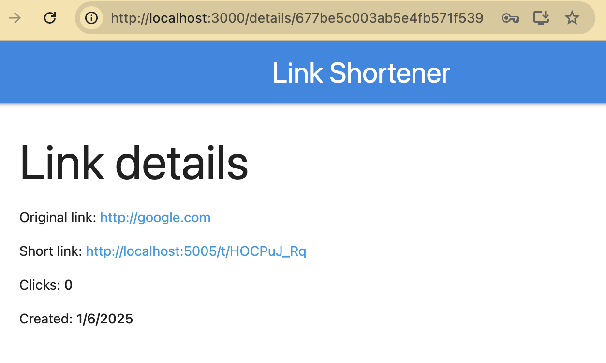

# URL Shortener app build using MERN stack (MongoBD, Express, ReactJS, Node.js) 🚀

## 🛠️ **Local Installation**

Run `npm i`\
Rename `config/default.json.exemple` to `config/default.json` and fill it.\
Run `npm start` or `npm run server` to start the app\

## 🏗️ **Production Installation**
Run `npm i`\
Rename `config/production.json.exemple` to `config/production.json` and fill it.\
Run `npm run client:install && npm run client:build` to build the client side\
Run `npm start` to start the app or use [`pm2`](https://pm2.keymetrics.io/docs/usage/quick-start/) proccess manager to keep your app live\

## 📦 Main pages
Here’s the main pages of the application:\
###Login page

### Create page

### Details page

### List page

